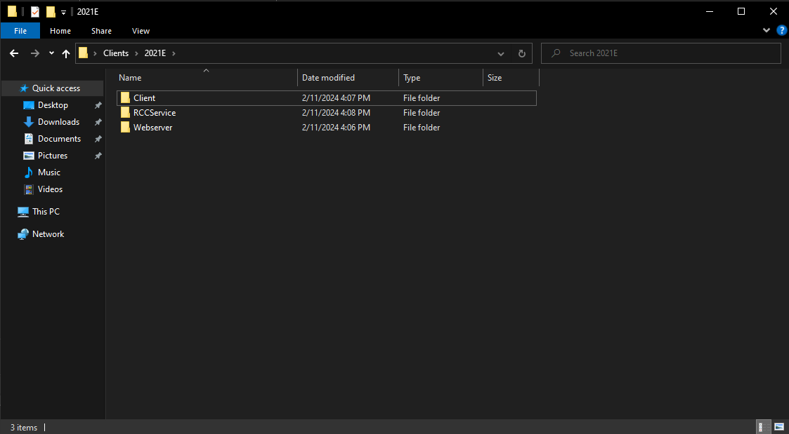
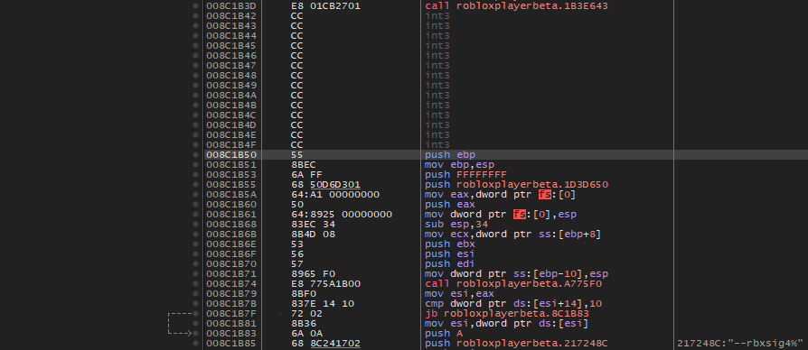
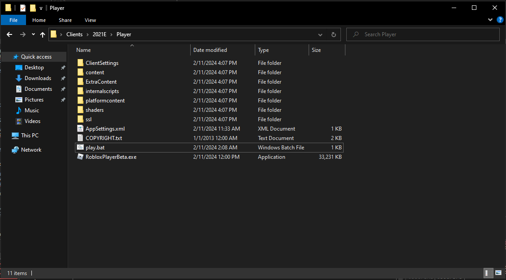

# 2021E Local Host Patching Guide

This guide is only how to patch the Roblox 2021E client to run on a local host. This guide is not for any other purpose, I do not recommend hosting this as a revival.

FILTERING IS DISABLED, AND SIGNING IS DISABLED! THIS IS NOT SECURE!

## Requirements
- [x32dbg](https://x64dbg.com/#start)
- [HxD](https://mh-nexus.de/en/hxd/)
- [Roblox 2021E](https://setup.rbxcdn.com/version-5a54208fe8e24e87-RobloxApp.zip)
- [RCCService](https://archive.org/download/20152021RCC/0.463.24788Bootstrapper.exe)
- [Webserver](https://www.mediafire.com/file/l2g0u80ad36r3i0/Webserver.7z/file)
- [2021E Content](https://www.mediafire.com/file/az99ei05rnp74pw/Content.7z/file)
- [Visual C++ Runtime](https://www.microsoft.com/en-us/download/details.aspx?id=30679)


**Recommended folder setup:**


## Patching Client
1. Open AppSettings.xml in the 2021E client folder and replace the code with the following:
```xml
<?xml version="1.0" encoding="UTF-8"?>
<Settings>
	<ContentFolder>content</ContentFolder>
	<BaseUrl>http://localhost/.127.0.0.1/</BaseUrl>
</Settings>
```

2. Open x32dbg, then drag the client into the window.
    -  Up top, click on `Smybols` then in the window look for `RobloxPlayerBeta.exe` and double click it.
    - Up top, there should be a solid right arrow. Click on it twice, this is to get around VMProtect.

3. Right click anywhere on the code and click `Search for` > `All Modules` > `String references...`
    - Wait for the module search to complete, in the search bar near the bottom, type `trust check` and wait.
    - Double click it, or right click on the first result and click `Follow in Disassembler`.
    - Scroll up a little bit and you should see a `jne` or `je` instruction, right click and select assemble it or press space, then change it to `jmp`.
    - Repeat this step for the second result.

4. After that return to the references tab up top. Search `--rbxsig4` and then double click it, or right click and click `Follow in Disassembler`.
    - Scroll up until you see a `push ebp` instruction underneath a bunch of `int3` instructions.
    - Right click on the `push ebp` instruction and click `Assemble` or press space, then change the whole instruction to `ret`. 
    <br>
    <br>
    - Example of what you should see:
    

5. Click on `File` > `Patch File...` and save it as `Patched.exe`.
    - Close x32dbg, then delete, rename, or move the old `RobloxPlayerBeta.exe`. After that, rename `Patched.exe` to `RobloxPlayerBeta.exe`.

6. Inside of the client folder create a new folder called `ClientSettings` and inside of that create a new file called `ClientAppSettings.json` and download [this file](https://www.mediafire.com/file/ktli6i6dkcxf1u4/ClientAppSettings.json/file) and move it into the folder.

7. Extract the `Content.7z` and then copy all of the files (NOT MOVE) into the client directory.
    - After that create a batch file in the client directory with the following code:
    ```bat
    start RobloxPlayerBeta.exe -a "http://localhost/Login/Negotiate.ashx" -j "http://localhost/game/placelauncher.ashx" -t "1"
    ```
    - When you are done, it should look like the following:
    

Done! You have successfully patched the client.

## Patching RCCService

1. Run `0.463.24788Bootstrapper.exe` as an administrator and let it install.
    - After it is done, open the `Roblox` folder in the `Program Files (x86)` directory. In there should be a folder called `RCC-` followed by a bunch of random letters and numbers.
    - Open that folder and copy the contents and move them into the `RCCService` folder inside of your main 2021E folder.

2. Open `RCCService.exe` in HxD by dragging it into the window.
    - Press `Ctrl + F` and search for `00 68 74 74 70 73 00`.
    - Replace it with `00 68 74 74 70 00 00`.
    - Save the file and close HxD.

3. Perform the same trust check patching as you did with the client, but with `RCCService.exe` instead in x32dbg.
    - After that, you need to patch `Non-trusted BaseURL used. HttpRbxApiService is only for Roblox API calls`, search that string and patch the `jne` or `je` instruction to `jmp` like you did with the client.
    - Patch the file like you did with the client, then delete, rename, or move the old `RCCService.exe` and rename `Patched.exe` to `RCCService.exe`.
    
4. Go back to the `Contents` directory and copy all of the files (NOT MOVE) into the `RCCService` folder.
    - After that create a batch file in the `RCCService` directory with the following code:
    ```bat
    RCCService.exe -Console -verbose -placeid:1818 -localtest "gameserver.json" -settingsfile "DevSettingsFile.json" -port 64989
    ```

5. You must place these two files inside of the RCCService folder:
    - [DevSettingsFile.json](https://www.mediafire.com/file/z6fu21i4lt6qo3f/DevSettingsFile.json/file)
    - [gameserver.json](https://www.mediafire.com/file/n75folbg0dwt9m7/gameserver.json/file)

Done! You have successfully patched RCCService.

## Setting up the Webserver
1. Extract the `Webserver.7z` and move it to your main 2021E folder.
    - Inside the `Webserver` folder, run uwamp.exe, and click allow twice if prompted by Windows Firewall.
    - If apache does not start make sure you have the Visual C++ Runtime installed.

Done! You have successfully set up the webserver.

## Playing
*you must run these in order!*
1. Run `UwAmp.exe` in the `Webserver` folder. (If not already running)
2. Run `RCCService.bat` in the `RCCService` folder.
3. Run `Client.bat` in the client folder.

<br>

- If you would like to configure the username, avatar, etc. Its all in the webserver folder in the `www` directory.
- If you would like to test other games, inside of the `www` directory open the `.127.0.0.1` folder, and inside of assets upload a `.rbxl` file (make sure to remove the .rbxl extension from the file name) and rename it to an id.
    - In order to actually play it modify gameserver.json in RCCService, change the id inside of the `PlaceFetchUrl` to the id of the place asset.
    

    Example:
    ```json
    "PlaceFetchUrl":"http://localhost/.127.0.0.1/asset/?id=69420",
    ```
    ```diff
    - "PlaceFetchUrl":".../asset/?id=2753915549"
    + "PlaceFetchUrl":".../asset/?id=69420"
    ```
